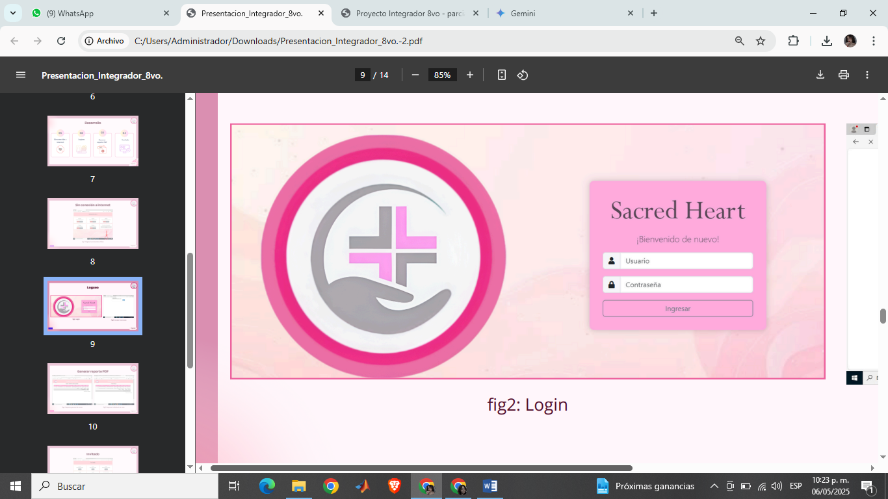

# Universidad politécnica de Juventino Rosas 

## Desarrollo de un sistema de base de datos para la consulta de contenidos y servicios ofrecidos por un hospital.
## Reporte Proyecto Integrador - 8°"B" 

### Presentan:

* Cruz Mendoza Brenda Sofía
* Lopez García Sandra Ximena
* Velasquez Gámez Hannia María
* Vargas Conejo Francisco Javier

### Asesor:
* Gallegos Galindo Juan Heriberto

## Resumen

A lo largo de las dos entregas anteriores, se planteó el proyecto con base en las deficiencias que conlleva tener la administración de forma física dentro de Instituciones de salud.
Por consiguiente, se utilizaron datos reales de una institución médica, con el objetivo de implementar un sistema que automatice todos los procesos internos que se llevan a cabo en la organización, logrando así el primer avance del proyecto, el cual constó del planteamiento y diseño de las tablas que conforman la base de datos, las cuales son correspondientes a las diferentes áreas del hospital.

Posteriormente, se trabajó con el desarrollo de un servidor que permite a los usuarios dentro de la red LAN del hospital, en conjunto con la página desarrollada, visualizar y modificar la información desde distintos dispositivos.

Durante este cuatrimestre se realizó la implementación del sector contable, para poder completar la parte administrativa ofreciendo así un sistema más completo y eficiente.
Además, se debe tener en cuenta que la parte más vulnerable de cualquier sistema implementado es la seguridad, por ello actualizar constantemente con el fin de mejorar la seguridad da como resultado un mejor control en los accesos y modificaciones dentro de la base de datos.

>[!NOTE]
   >
   >Para revisar la información de forma completa acceder a los siguientes links .
